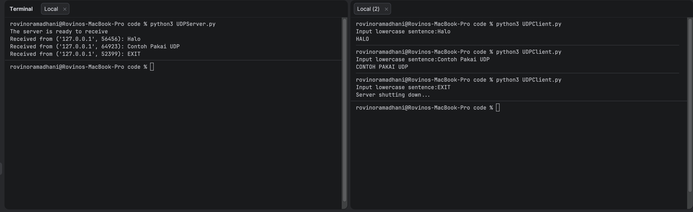
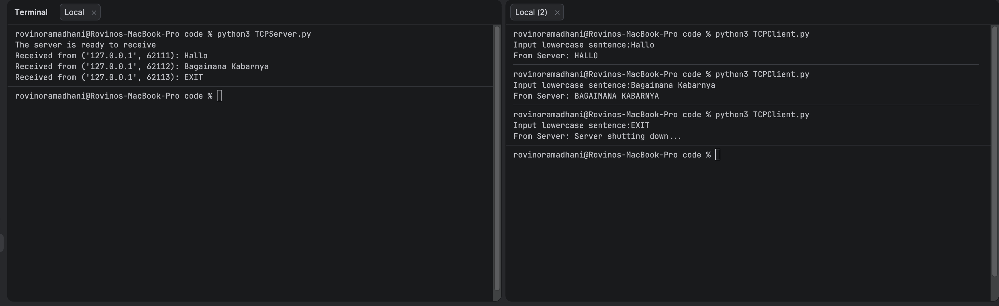

# Tugas Praktikum Week 7 | Modul 7 Socket Programming: Membuat Aplikasi Jaringan

Nama : Rovino Ramadhani  
NIM : 103072400031  
Kelas : IF-04-01

___
## Penjelasan UDP Client
```` python
from socket import *

serverName = ‘127.0.0.1’
serverPort = 12000

clientSocket = socket(AF_INET, SOCK_DGRAM)

message = input(‘Input lowercase sentence:’)

clientSocket.sendto(message.encode(), (serverName, serverPort))

modifiedMessage, serverAddress = clientSocket.recvfrom(2048)

print(modifiedMessage.decode())

clientSocket.close()
````

Program UDPClient.py berfungsi sebagai client UDP yang mengirim kalimat dari user ke server. Program membuat socket UDP, mengirim pesan menggunakan sendto(), menerima balasan dengan recvfrom(), lalu menampilkan hasilnya.

### Penjelasan per potongan kode UDPClient.py:

- Mengimpor modul socket:
  ```python
  from socket import *
  ```
  Agar dapat menggunakan fungsi socket di Python.

- Menentukan alamat dan port server:
  ```python
  serverName = '127.0.0.1'
  serverPort = 12000
  ```
  Alamat IP dan port tujuan server UDP.

- Membuat socket UDP:
  ```python
  clientSocket = socket(AF_INET, SOCK_DGRAM)
  ```
  Membuat objek socket bertipe UDP.

- Mengambil input dari user:
  ```python
  message = input('Input lowercase sentence:')
  ```
  User memasukkan pesan yang akan dikirim ke server.

- Mengirim pesan ke server:
  ```python
  clientSocket.sendto(message.encode(), (serverName, serverPort))
  ```
  Pesan dikirim ke server setelah di-encode.

- Menerima balasan dari server:
  ```python
  modifiedMessage, serverAddress = clientSocket.recvfrom(2048)
  ```
  Menerima balasan dari server.

- Menampilkan balasan:
  ```python
  print(modifiedMessage.decode())
  ```
  Menampilkan hasil balasan dari server.

- Menutup socket:
  ```python
  clientSocket.close()
  ```
  Socket ditutup setelah komunikasi selesai.


## Penjelasan UDP Server

```` python
from socket import *

serverPort = 12000

serverSocket = socket(AF_INET, SOCK_DGRAM)

serverSocket.bind(('', serverPort))

print('The server is ready to receive')

running = True
while running:
	message, clientAddress = serverSocket.recvfrom(2048)
	decoded_message = message.decode()
	print(f"Received from {clientAddress}: {decoded_message}")
	if decoded_message.strip().upper() == "EXIT":
		serverSocket.sendto("Server shutting down...".encode(), clientAddress)
		running = False
		break
	modifiedMessage = decoded_message.upper()
	serverSocket.sendto(modifiedMessage.encode(), clientAddress)

serverSocket.close()
````

Program UDPServer.py berfungsi sebagai server UDP yang menerima pesan dari client. Pesan diubah menjadi huruf kapital menggunakan upper(), lalu dikirim kembali ke client. Jika menerima pesan "EXIT", server akan menutup diri secara otomatis.

### Penjelasan per potongan kode UDPServer.py:

- Import modul socket:
  ```python
  from socket import *
  ```

- Inisialisasi port server:
  ```python
  serverPort = 12000
  ```

- Membuat socket UDP:
  ```python
  serverSocket = socket(AF_INET, SOCK_DGRAM)
  ```

- Bind socket ke alamat dan port:
  ```python
  serverSocket.bind(('', serverPort))
  ```
  Socket diikat ke alamat lokal dan port tertentu.

- Menampilkan status server:
  ```python
  print('The server is ready to receive')
  ```

- Loop utama server:
  ```python
  running = True
  while running:
	  message, clientAddress = serverSocket.recvfrom(2048)
	  decoded_message = message.decode()
	  print(f"Received from {clientAddress}: {decoded_message}")
	  if decoded_message.strip().upper() == "EXIT":
		  serverSocket.sendto("Server shutting down...".encode(), clientAddress)
		  running = False
		  break
	  modifiedMessage = decoded_message.upper()
	  serverSocket.sendto(modifiedMessage.encode(), clientAddress)
  ```
  - Menerima pesan dari client, cek jika pesan "EXIT" maka server shutdown, jika tidak maka pesan diubah ke huruf kapital dan dikirim balik ke client.

- Menutup socket:
  ```python
  serverSocket.close()
  ```


## Penjelasan TCP Client

```` python
from socket import *

serverName = ‘127.0.0.1’
serverPort = 12000

clientSocket = socket(AF_INET, SOCK_STREAM)

clientSocket.connect((serverName, serverPort))

sentence = input(‘Input lowercase sentence:’)

clientSocket.send(sentence.encode())

modifiedSentence = clientSocket.recv(2048)

print(‘From Server:’, modifiedSentence.decode())

clientSocket.close()
````

Program TCPClient.py berfungsi sebagai client TCP yang mengirim kalimat ke server. Client membuat koneksi ke server menggunakan connect(), mengirim pesan dengan send(), menerima balasan menggunakan recv(), lalu menutup koneksi.

### Penjelasan per potongan kode TCPClient.py:

- Import modul socket:
  ```python
  from socket import *
  ```

- Inisialisasi alamat dan port server:
  ```python
  serverName = '127.0.0.1'
  serverPort = 12000
  ```

- Membuat socket TCP:
  ```python
  clientSocket = socket(AF_INET, SOCK_STREAM)
  ```

- Membuka koneksi ke server:
  ```python
  clientSocket.connect((serverName, serverPort))
  ```

- Input pesan dari user:
  ```python
  sentence = input('Input lowercase sentence:')
  ```

- Mengirim pesan ke server:
  ```python
  clientSocket.send(sentence.encode())
  ```

- Menerima balasan dari server:
  ```python
  modifiedSentence = clientSocket.recv(2048)
  ```

- Menampilkan balasan:
  ```python
  print('From Server:', modifiedSentence.decode())
  ```

- Menutup socket:
  ```python
  clientSocket.close()
  ```


## Penjelasan TCP Server

```` python
from socket import *

serverPort = 12000

serverSocket = socket(AF_INET, SOCK_STREAM)

serverSocket.bind(('', serverPort))

serverSocket.listen(1)

print('The server is ready to receive')

running = True
while running:
	connectionSocket, addr = serverSocket.accept()
	sentence = connectionSocket.recv(1024).decode()
	print(f"Received from {addr}: {sentence}")
	if sentence.strip().upper() == "EXIT":
		connectionSocket.send("Server shutting down...".encode())
		connectionSocket.close()
		running = False
		break
	capitalizedSentence = sentence.upper()
	connectionSocket.send(capitalizedSentence.encode())
	connectionSocket.close()

serverSocket.close()
````

Program TCPServer.py berfungsi sebagai server TCP yang menerima koneksi dari client. Server menerima data, mengubahnya menjadi huruf kapital, mengirimkan hasilnya kembali, lalu menutup koneksi client. Jika menerima pesan "EXIT", server akan menutup diri secara otomatis.

### Penjelasan per potongan kode TCPServer.py:

- Import modul socket:
  ```python
  from socket import *
  ```

- Inisialisasi port server:
  ```python
  serverPort = 12000
  ```

- Membuat socket TCP:
  ```python
  serverSocket = socket(AF_INET, SOCK_STREAM)
  ```

- Bind socket ke alamat dan port:
  ```python
  serverSocket.bind(('', serverPort))
  ```

- Listen koneksi:
  ```python
  serverSocket.listen(1)
  ```

- Menampilkan status server:
  ```python
  print('The server is ready to receive')
  ```

- Loop utama server:
  ```python
  running = True
  while running:
	  connectionSocket, addr = serverSocket.accept()
	  sentence = connectionSocket.recv(1024).decode()
	  print(f"Received from {addr}: {sentence}")
	  if sentence.strip().upper() == "EXIT":
		  connectionSocket.send("Server shutting down...".encode())
		  connectionSocket.close()
		  running = False
		  break
	  capitalizedSentence = sentence.upper()
	  connectionSocket.send(capitalizedSentence.encode())
	  connectionSocket.close()
  ```
  - Menerima koneksi dari client, menerima pesan, cek jika "EXIT" maka server shutdown, jika tidak maka pesan diubah ke huruf kapital dan dikirim balik ke client, lalu koneksi client ditutup.

- Menutup socket:
  ```python
  serverSocket.close()
  ```
___
### Ouput UDP :  
  
### Ouput TCP :


___
## Kesimpulan
Dalam praktikum ini, kita belajar tentang pemrograman socket menggunakan protokol UDP dan TCP. Kita membuat aplikasi client-server sederhana yang dapat mengirim dan menerima pesan. Pada UDP, komunikasi bersifat connectionless, sedangkan pada TCP, komunikasi bersifat connection-oriented. Kita juga menambahkan fitur untuk mematikan server dengan mengirim pesan "EXIT". Pemrograman socket adalah dasar penting dalam pengembangan aplikasi jaringan.