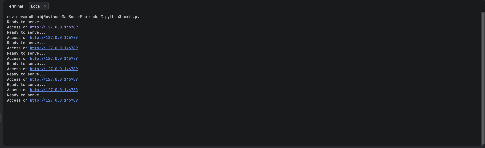

# Tugas Praktikum Week 9 | Modul 9 Web Server: Web Server Sederhana (Python Socket)

Nama : Rovino Ramadhani  
NIM : 103072400031  
Kelas : IF-04-01

___

## Struktur Folder

- `code/main.py` → program web server (HTTP) berbasis TCP socket.
- `code/index.html` → halaman default ketika user mengakses `/`.
- `code/404.html` → halaman ketika file yang diminta tidak ditemukan.
- `asset/` → screenshot hasil percobaan.

> Catatan: program membaca file HTML menggunakan *relative path*, sehingga server sebaiknya dijalankan dari folder `code/`.

___

## Penjelasan Program Web Server (`main.py`)

Berikut adalah kode program `main.py`:

````python
from socket import *
import sys
import os

serverSocket = socket(AF_INET, SOCK_STREAM)
serverSocket.setsockopt(SOL_SOCKET, SO_REUSEADDR, 1)
serverSocket.bind(('', 6789))
serverSocket.listen(1)

while True:
	print('Ready to serve...')
	print('Access on http://127.0.0.1:6789')
	connectionSocket, addr = serverSocket.accept()

	try:
		message = connectionSocket.recv(1024).decode()
		filename = message.split()[1]

		if filename == '/':
			filename = '/index.html'

		filepath = filename[1:]

		if not os.path.exists(filepath):
			filepath = '404.html'
			status = 'HTTP/1.1 404 Not Found\r\n'
		else:
			status = 'HTTP/1.1 200 OK\r\n'

		with open(filepath, 'r', encoding='utf-8') as f:
			outputdata = f.read()

		header = status + 'Content-Type: text/html\r\n\r\n'
		connectionSocket.send(header.encode())
		connectionSocket.send(outputdata.encode())

		connectionSocket.close()

	except Exception:
		connectionSocket.send('HTTP/1.1 500 Internal Server Error\r\n\r\n'.encode())
		connectionSocket.close()

serverSocket.close()
sys.exit()
````

Program `main.py` adalah web server sederhana yang menggunakan **TCP socket** untuk menerima request HTTP dari browser, kemudian mengirimkan response berupa file HTML.

### Penjelasan per bagian kode

- **Import library**
  ```python
  from socket import *
  import sys
  import os
  ```
  - `socket` digunakan untuk komunikasi jaringan.
  - `os` dipakai untuk mengecek keberadaan file (`os.path.exists`).
  - `sys` dipakai untuk keluar dari program (di bagian akhir).

- **Membuat TCP socket + konfigurasi reuse address**
  ```python
  serverSocket = socket(AF_INET, SOCK_STREAM)
  serverSocket.setsockopt(SOL_SOCKET, SO_REUSEADDR, 1)
  ```
  - `AF_INET` artinya menggunakan IPv4.
  - `SOCK_STREAM` artinya menggunakan TCP.
  - `SO_REUSEADDR` membantu supaya port bisa langsung dipakai lagi setelah program dihentikan.

- **Bind dan listen pada port 6789**
  ```python
  serverSocket.bind(('', 6789))
  serverSocket.listen(1)
  ```
  - Bind ke `''` artinya menerima koneksi dari semua network interface di komputer.
  - `listen(1)` membatasi backlog antrian koneksi.

- **Loop utama server: menerima koneksi**
  ```python
  while True:
	  connectionSocket, addr = serverSocket.accept()
  ```
  Server berjalan terus menerus dan menerima koneksi dari client (browser).

- **Membaca HTTP request dan mengambil path file**
  ```python
  message = connectionSocket.recv(1024).decode()
  filename = message.split()[1]
  ```
  - `recv(1024)` membaca request.
  - `message.split()[1]` mengambil bagian path dari request line, contoh:
	- Request: `GET /index.html HTTP/1.1`
	- Path: `/index.html`

- **Mapping root `/` menjadi `/index.html`**
  ```python
  if filename == '/':
	  filename = '/index.html'
  ```

- **Konversi path URL ke path file lokal**
  ```python
  filepath = filename[1:]
  ```
  Contoh: `/index.html` → `index.html`.

- **Jika file tidak ada → kirim 404 dan gunakan `404.html`**
  ```python
  if not os.path.exists(filepath):
	  filepath = '404.html'
	  status = 'HTTP/1.1 404 Not Found\r\n'
  else:
	  status = 'HTTP/1.1 200 OK\r\n'
  ```

- **Membaca file dan mengirim HTTP response**
  ```python
  with open(filepath, 'r', encoding='utf-8') as f:
	  outputdata = f.read()

  header = status + 'Content-Type: text/html\r\n\r\n'
  connectionSocket.send(header.encode())
  connectionSocket.send(outputdata.encode())
  ```
  Response terdiri dari:
  - Status line (`200 OK` atau `404 Not Found`)
  - Header `Content-Type`
  - Baris kosong (`\r\n\r\n`)
  - Body HTML

- **Error handling (500)**
  ```python
  except Exception:
	  connectionSocket.send('HTTP/1.1 500 Internal Server Error\r\n\r\n'.encode())
	  connectionSocket.close()
  ```
  Jika terjadi error saat parsing request / membaca file, server mengembalikan status `500`.

___

## Penjelasan Halaman HTML

### `index.html` (halaman utama)

`index.html` ditampilkan saat user mengakses `/`. Halaman dibuat sederhana menggunakan Tailwind via CDN.

### `404.html` (halaman not found)

`404.html` ditampilkan saat user mengakses file yang tidak tersedia di folder `code/`.

___

## Output / Hasil Percobaan

### Server berjalan di terminal


### Halaman ditemukan (200 OK)


### Halaman tidak ditemukan (404)


___

## Kesimpulan

Pada web server HTTP sederhana menggunakan Python Socket (TCP). Server menerima request `GET` dari browser, memetakan URL ke file HTML lokal, lalu mengembalikan response `200 OK` jika file ada atau `404 Not Found` jika file tidak ada. Ini menunjukkan konsep dasar cara kerja web server: **mendengarkan koneksi**, **membaca request**, **memproses resource**, dan **mengirim response**.
