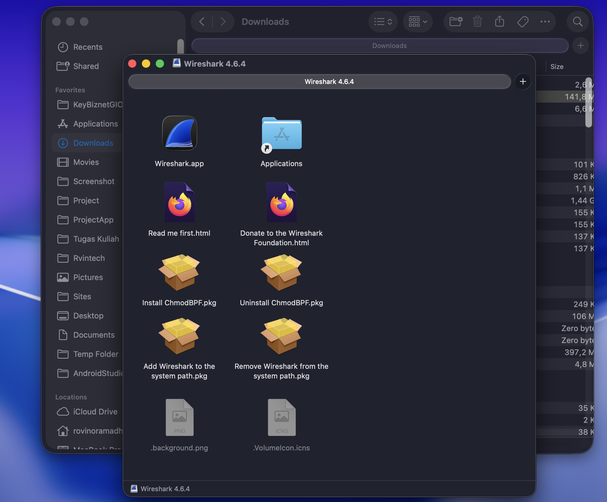
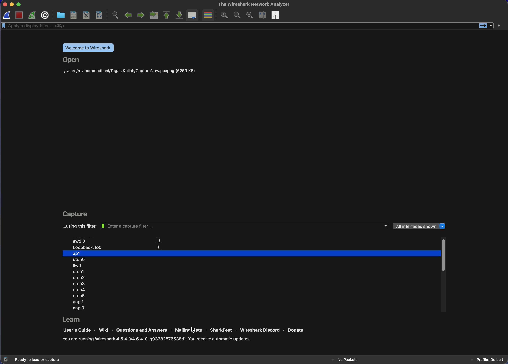

## Tugas Praktikum Week 1 - Instal Wire Shark

Nama : Rovino Ramadhani  
NIM : 103072400031  
Kelas : IF-04-01

### Langkah 1: Download Wire Shark Dan Install
installnya bisa didownload di https://www.wireshark.org/download.html, lalu pilih sesuai dengan sistem operasi yang digunakan. Setelah selesai mendownload, buka file instalasi dan install WireShark.app, ChmodBPF.pkg, dan Add Wireshark to PATH.pkg

### Langkah 2: Buka Wire Shark
Setelah selesai menginstall, buka aplikasi Wire Shark. Jika tidak muncul error, maka instalasi berhasil.

