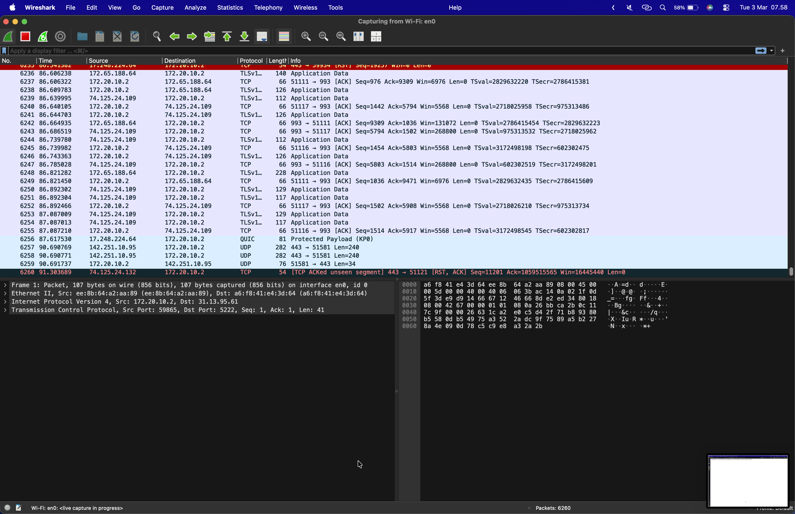
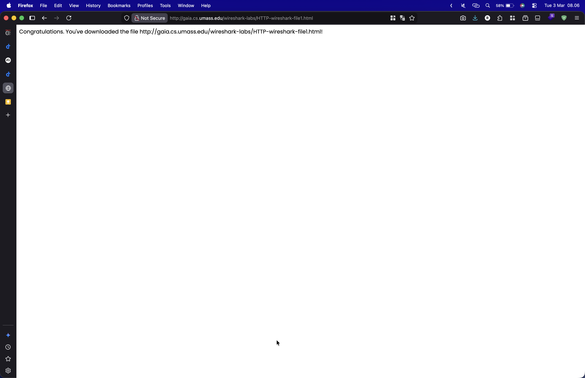
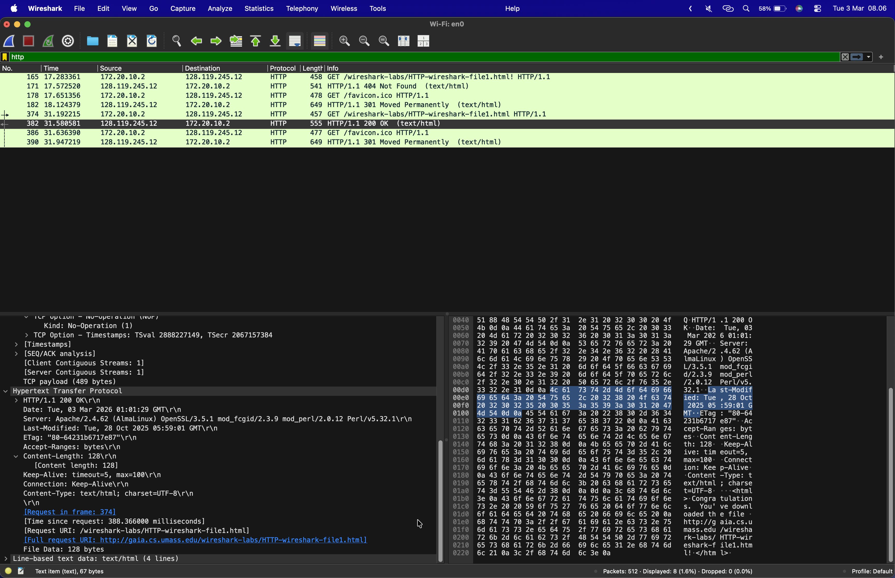

# Tugas Praktikum Week 2- Buka Wire Shark Dan Testing Wire Shark

Nama : Rovino Ramadhani  
NIM : 103072400031  
Kelas : IF-04-01

### Langkah 1: Buka Wire Shark
Buka aplikasi Wire Shark yang sudah diinstall pada praktikum sebelumnya. dan pilih capture wifi yang digunakan, lalu klik tombol start untuk memulai capture

### Langkah 2: Testing Wire Shark
Jika sudah klik start, maka akan muncul tampilan seperti ini

### Langkah 3: Akses Website
Setelah itu, buka browser dan akses website ...

### Langkah 4: Stop Capture
Setelah selesai, klik tombol Stop yang ada di pojok kiri atas untuk menghentikan capture dan cari di kolom pencarian http nanti akan muncul beberapa list berisikan http
 
Untuk panah ke kanan artinya adalah request, sedangkan panah ke kiri artinya response
