# Tugas Praktikum Week 3 - HTTP

Nama : Rovino Ramadhani  
NIM : 103072400031  
Kelas : IF-04-01

## 1. Basic HTTP GET/Response Interaction
1. Jalankan aplikasi Wireshark dan tentukan *interface* jaringan yang sedang aktif digunakan, lalu masukkan filter `http` pada bagian *display filter* agar trafik yang teramati hanya terfokus pada protokol HTTP saja.
    
2. Lakukan *start capture* guna memulai proses *packet sniffing* sebelum melakukan aktivitas pada peramban web.
3. Buka *browser* dan akses URL `http://gaia.cs.umass.edu/wireshark-labs/HTTP-wireshark-file1.html`. Pada tahap ini, *browser* akan melakukan *request* ke *server* untuk mengambil dokumen HTML yang dituju.
    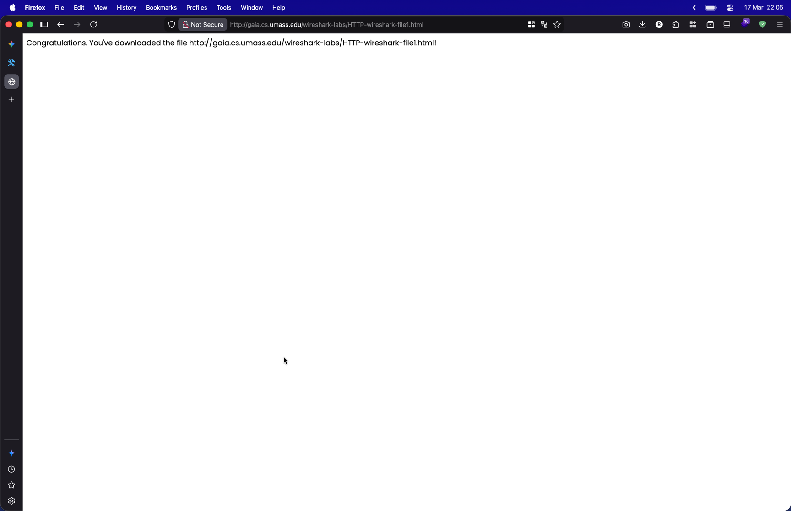

4. Setelah halaman web muncul secara utuh, segera lakukan *stop scan* pada Wireshark. Hasil dari *capture* paket tersebut dapat diamati sebagai berikut:

   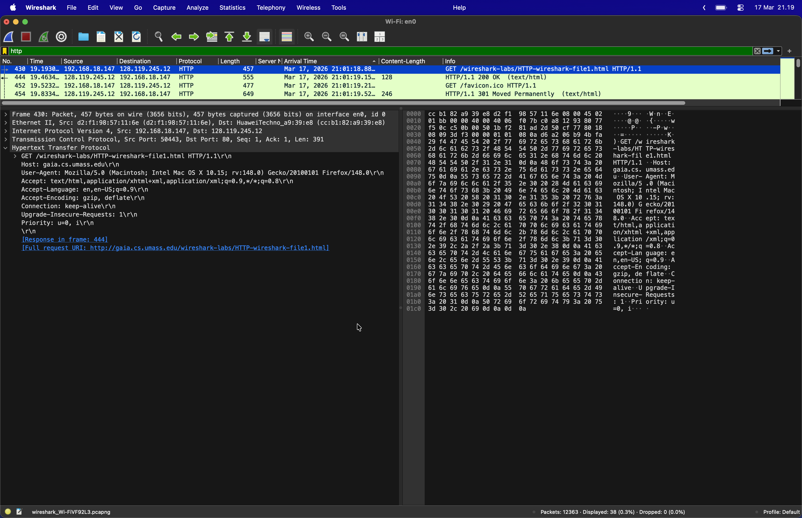

5. Dari hasil *capture* yang diperoleh, dapat diidentifikasi paket-paket utama yang terlibat dalam interaksi ini:
    * **430**: Paket ini merupakan **HTTP GET**, yang mana *browser* melakukan *request* dokumen spesifik kepada *server* `gaia.cs.umass.edu`.
    * **444**: Paket ini adalah *response* **HTTP/1.1 200 OK** dari *server*, yang menunjukkan bahwa *request* dari klien berhasil diproses dan *server* mengirimkan isi *file* HTML tersebut kembali ke klien.

## 2. HTTP CONDITIONAL GET/response interaction

1. Bersihkan *history* dan *cache* pada *browser* terlebih dahulu agar *browser* benar-benar melakukan pengambilan data baru dari *server* tanpa menggunakan data lama yang tersimpan secara lokal.
2. Jalankan Wireshark dan lakukan *start capture* dengan filter `http` aktif untuk memantau proses *request* dan *response* secara spesifik.
3. Akses URL `http://gaia.cs.umass.edu/wireshark-labs/HTTP-wireshark-file2.html` melalui *browser*, kemudian lakukan *refresh* halaman atau masukkan kembali URL yang sama secara cepat untuk memicu mekanisme *conditional GET*.

   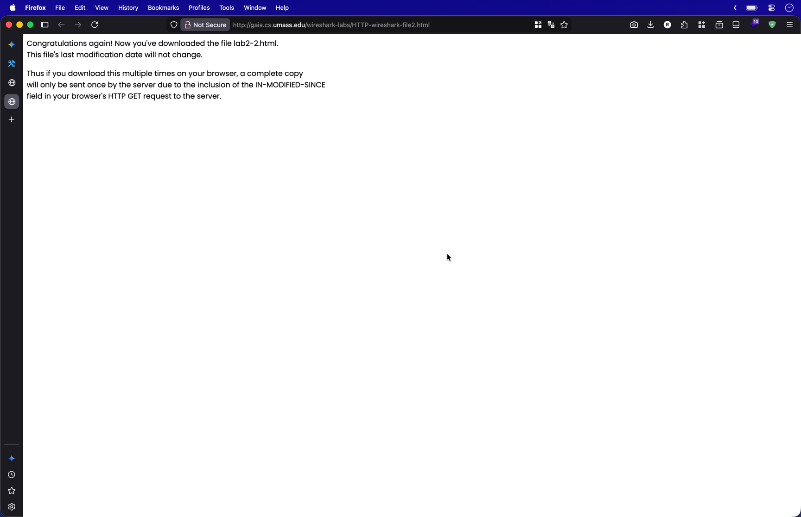   

4. Klik tombol *stop* pada Wireshark setelah proses pemuatan halaman selesai. Hasil *capture* paket akan menampilkan dua kali interaksi *request-response* seperti pada gambar di bawah ini:

   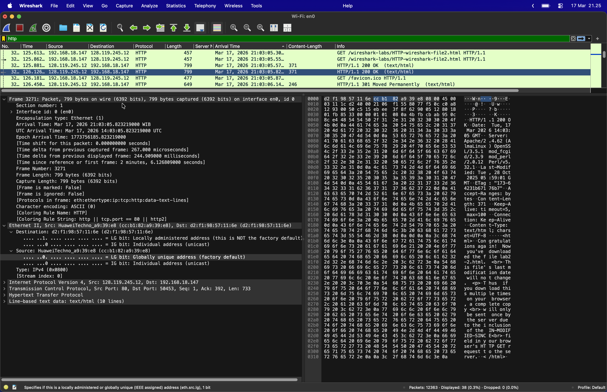

5. Lakukan observasi pada daftar paket untuk melihat perbedaan antara akses pertama dan akses kedua:
    * **Paket GET Pertama & Kedua**: Pada *request* kedua, *browser* akan menyertakan *header* `If-Modified-Since` untuk menanyakan kepada *server* apakah isi *file* sudah berubah sejak akses terakhir kali dilakukan.
    * **Paket Response (200 OK)**: Berdasarkan *screenshot*, *server* memberikan *response* **200 OK** pada kedua sesi. Hal ini menandakan *server* tetap mengirimkan kembali seluruh isi dokumen secara utuh. Dalam kondisi lain di mana data tidak berubah, *server* biasanya akan membalas dengan kode **304 Not Modified** guna menghemat *bandwidth*.

## 3. Retrieving Long Documents

1. Bersihkan *cache* dan *history* pada *browser* terlebih dahulu guna memastikan dokumen diambil secara utuh langsung dari *server* tanpa menggunakan salinan lokal.
2. Jalankan pemindaian paket pada Wireshark dengan menerapkan filter `http` untuk memfokuskan pengamatan pada trafik protokol tersebut.
3. Akses URL `http://gaia.cs.umass.edu/wireshark-labs/HTTP-wireshark-file3.html`. Pada langkah ini, *browser* akan melakukan *request* dokumen HTML yang berukuran besar (sekitar 4500 *byte*), sehingga data tersebut tidak dapat dimuat dalam satu paket TCP saja.

   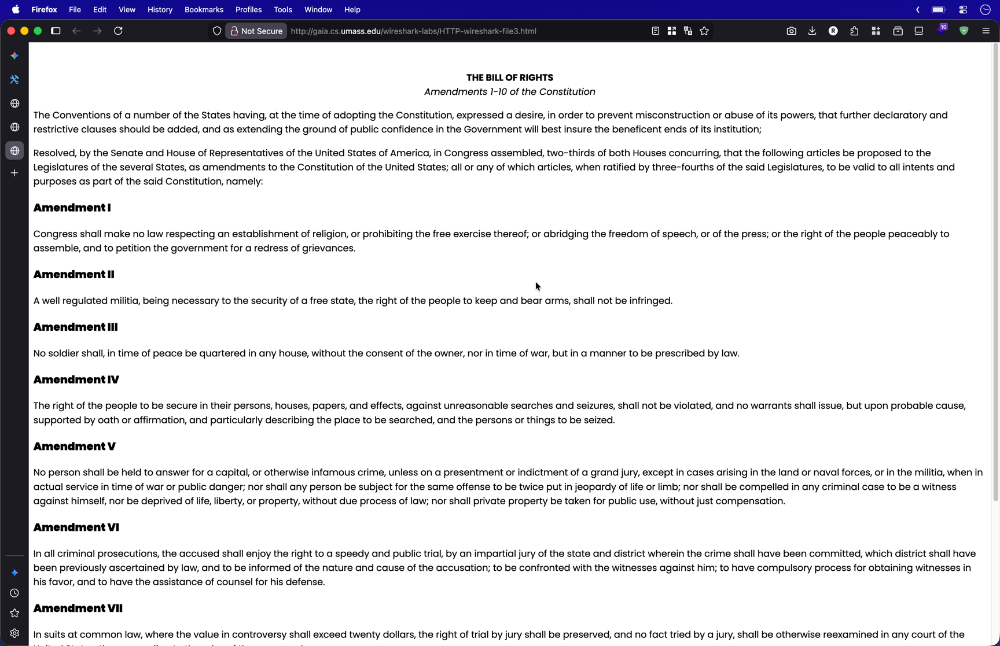

4. Lakukan *stop capture* segera setelah halaman web termuat sempurna. Hasil rekaman paket dapat diamati pada gambar berikut:

   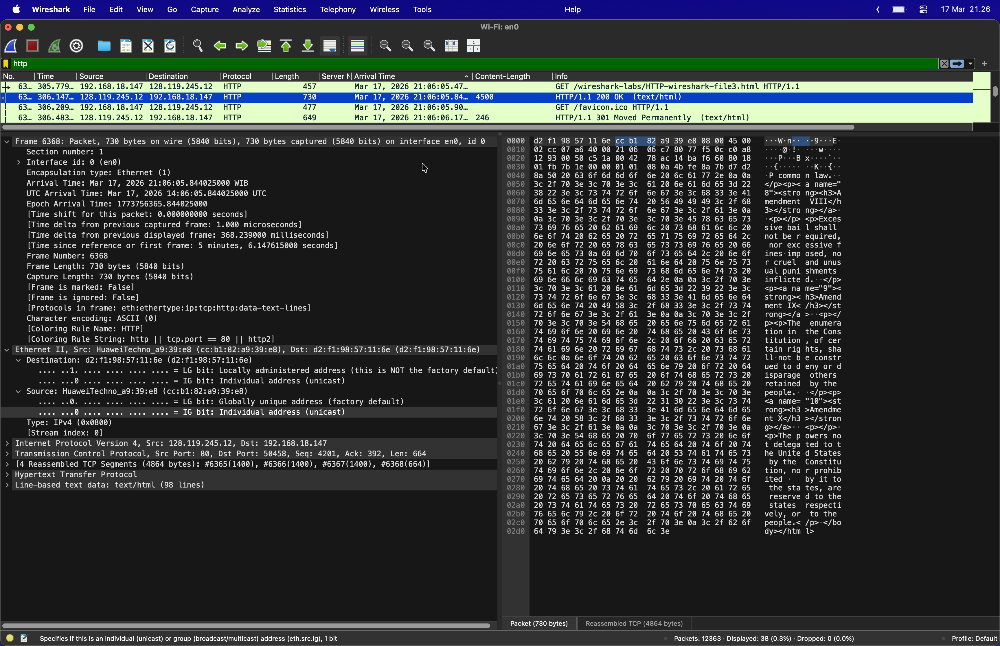

5. Lakukan analisis terhadap interaksi paket yang merepresentasikan pengunduhan dokumen besar tersebut:
    * **HTTP GET**: Paket ini merupakan *request* dari *browser* klien menuju *server* untuk mengambil dokumen spesifik.
    * **HTTP/1.1 200 OK (Reassembled)**: Pada paket nomor 6348, terlihat *response* sukses dari *server*. Karena ukuran *file* yang besar, data dikirimkan dalam beberapa fragmen. Hal ini terlihat pada panel rincian paket yang memuat keterangan **"4 Reassembled TCP Segments"**, yang menandakan bahwa Wireshark menggabungkan kembali 4 segmen TCP menjadi satu *response* HTTP yang lengkap.

## 4. HTML Documents dengan Embedded Objects

1. Pastikan untuk melakukan pembersihan *cache* dan *history* pada *browser* terlebih dahulu guna menjamin bahwa semua objek (baik HTML maupun gambar) akan di-*fetch* ulang secara langsung dari *server*.
2. Jalankan Wireshark dan aktifkan filter `http` sebelum memulai proses *capture* paket data.
3. Akses URL `http://gaia.cs.umass.edu/wireshark-labs/HTTP-wireshark-file4.html`. Perlu diperhatikan bahwa halaman ini mengandung *embedded objects* berupa dua buah gambar yang direferensikan di dalam dokumen utama.

   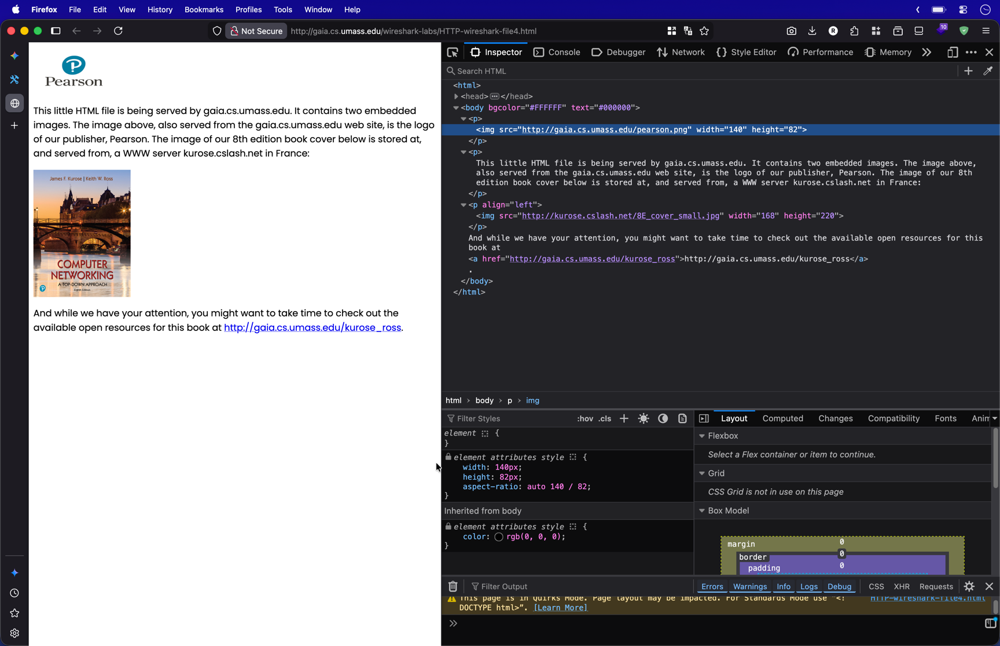

4. Segera hentikan pemindaian pada Wireshark setelah seluruh elemen halaman muncul secara sempurna. Hasil penangkapan paket dapat diamati pada gambar di bawah ini:

   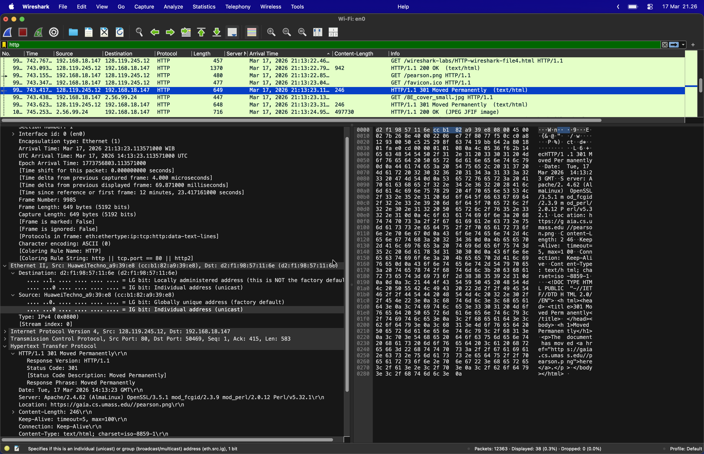

5. Lakukan pengamatan pada daftar paket untuk memahami mekanisme *browser* dalam menangani objek yang tersemat (*embedded*):
   * **Request HTML Utama**: Terlihat *browser* melakukan **GET** awal untuk mengambil *file* `HTTP-wireshark-file4.html`. Setelah menerima *response* **200 OK**, *browser* akan melakukan *parsing* terhadap kode HTML tersebut.
   * **Request Embedded Objects**: Karena di dalam dokumen HTML terdapat URL gambar, *browser* secara otomatis mengirimkan pesan **GET** tambahan (seperti pada *request* `pearson.png`) untuk mengunduh objek tersebut secara terpisah.
   * **Response & Redirection**: Berdasarkan *screenshot*, terdapat status **301 Moved Permanently** yang menandakan adanya pengalihan lokasi objek. Setelah itu, muncul *response* **200 OK (JPEG JFIF image)** yang mengonfirmasi bahwa data gambar telah berhasil diterima sepenuhnya oleh sisi klien.

## 5. HTTP Authentication

1. Pastikan *cache* dan *history* pada *browser* sudah dibersihkan guna menjamin proses otentikasi terekam dari awal tanpa adanya data login yang tersimpan sebelumnya.
2. Buka aplikasi Wireshark, aktifkan filter `http`, lalu tekan *start capture* untuk mulai memonitor trafik data.
3. Kunjungi alamat URL yang terproteksi: `http://gaia.cs.umass.edu/wireshark-labs/protected_pages/HTTP-wireshark-file5.html`.
4. Masukkan *username* "wireshark-students" dan *password* "network" pada jendela *pop-up* yang muncul di peramban.

   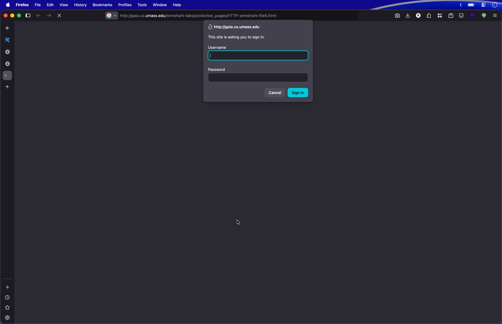

5. Lakukan *stop scan* pada Wireshark segera setelah akses ke halaman sukses diberikan. Hasil pengamatan paket adalah sebagai berikut:

   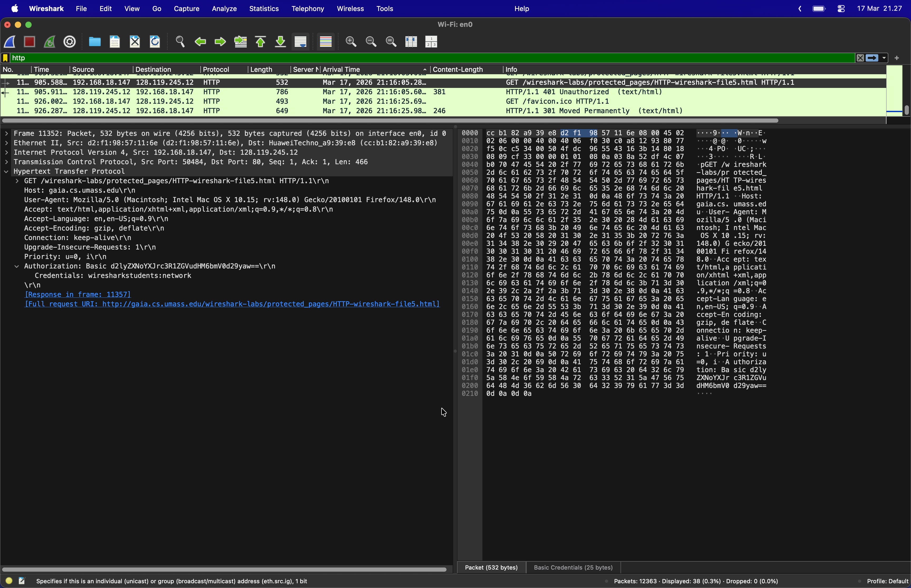
     
  

6. Lakukan peninjauan terhadap urutan paket untuk memahami mekanisme otentikasi akses:
   * **Response 401 Unauthorized**: Terlihat *server* mengirimkan balasan **401 Unauthorized** pada percobaan akses pertama. Status ini memicu *browser* untuk menampilkan kotak input kredensial kepada pengguna karena akses ke halaman tersebut dibatasi.
   * **Authorization Header**: Pada paket **GET** berikutnya (seperti yang disorot pada gambar), *browser* menyertakan *field* `Authorization: Basic` yang berisi *string* karakter tertentu.
   
   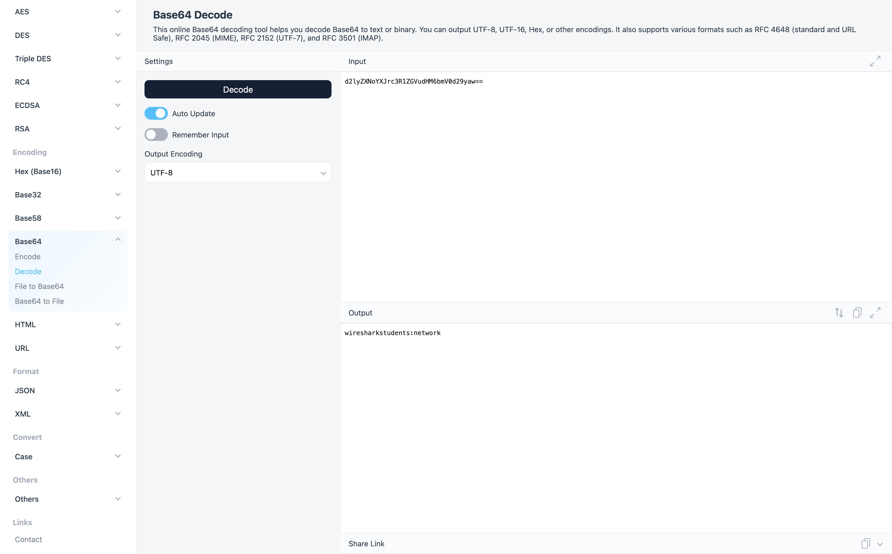
   * **Base64 Decoding**: *String* tersebut merupakan kredensial yang dikodekan dalam format **Base64**. Berdasarkan rincian paket di panel bawah, Wireshark secara otomatis melakukan *decode* dan menunjukkan *credentials* asli berupa `wiresharkstudents:network`. Hal ini membuktikan bahwa otentikasi dasar HTTP ini tidak terenkripsi dan hanya disandikan, sehingga memiliki risiko keamanan jika paket data berhasil disadap.